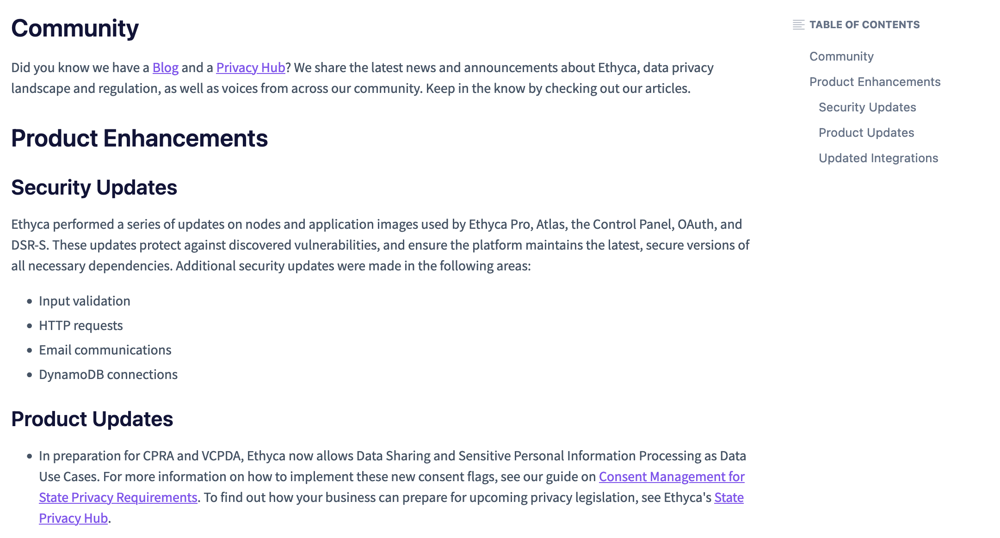

# Release Newsletter

## Summary

While serving as a Technical Writer for Ethyca, a software company creating automation tools for data privacy compliance, I was tasked with drafting and releasing our bimonthly newsletter for their legacy product. Newsletters communicating product information, updates, and changes are important for maintaining [SOC 2 compliance](https://www.aicpa-cima.com/topic/audit-assurance/audit-and-assurance-greater-than-soc-2). 

---

## Resources
[Live Document](https://support.ethyca.com/docs/october-november-2022-product-newsletter){ .md-button .md-button--primary }